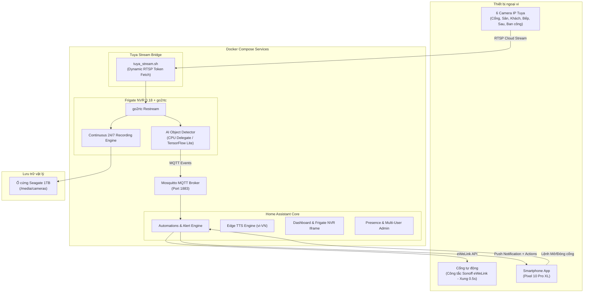

# 🏠 Smart Home & Frigate AI NVR System

Hệ sinh thái nhà thông minh toàn diện tích hợp **Home Assistant**, **Frigate NVR** (AI Object Detection), **Mosquitto MQTT Broker**, **Tuya Cloud Camera Stream Bridge**, và hệ thống điều khiển cổng tự động **Sonoff eWeLink**.

---

## 📑 Mục lục
- [1. Tính năng nổi bật](#1-tính-năng-nổi-bật)
- [2. Kiến trúc hệ thống](#2-kiến-trúc-hệ-thống)
- [3. Cấu hình Camera & Thứ tự hiển thị](#3-cấu-hình-camera--thứ-tự-hiển-thị)
- [4. Cơ chế thông báo & Điều khiển cổng thông minh](#4-cơ-chế-thông-báo--điều-khiển-cổng-thông-minh)
- [5. Hệ thống lưu trữ 24/7 & Chuẩn đoán dung lượng](#5-hệ-thống-lưu-trữ-247--chuẩn-đoán-dung-lượng)
- [6. Hướng dẫn cài đặt & Triển khai](#6-hướng-dẫn-cài-đặt--triển-khai)
- [7. Bảo mật & Quản lý thông tin nhạy cảm](#7-bảo-mật--quản-lý-thông-tin-nhạy-cảm)

---

## 1. Tính năng nổi bật

- 🎥 **Hệ thống giám sát 6 Camera AI 24/7:**
  - Phát hiện thông minh: Người (`person`), Ô tô (`car`), Xe máy (`motorcycle`), Xe đạp (`bicycle`), Chó (`dog`), Mèo (`cat`).
  - Lọc nhiễu thông minh (bỏ qua chim muông / bóng nắng rung động cây cối).
- 🚪 **Tích hợp Cổng tự động Sonoff:**
  - Điều khiển 2 cánh (`switch.main_gate`) và 1 cánh (`switch.sub_gate`).
  - Phần cứng đã được nạp sẵn chế độ xung 0.5s (Inching mode) qua eWeLink, Home Assistant gửi lệnh bật tức thì mà không cần cài đặt delay phức tạp.
- 📲 **Thông báo đẩy thông minh (Rich Push Notifications):**
  - Gửi ảnh snapshot kèm thông báo tức thì lên điện thoại (Pixel 10 Pro XL).
  - Tích hợp các nút hành động trực tiếp: `Xem clip`, `Mở/Đóng cổng`, `Mở/Đóng 1 cánh`.
  - Phân luồng thời gian: Chỉ cảnh báo người trong nhà (Khách, Bếp) từ 23h đêm đến 5h sáng; cảnh báo động vật (chó/mèo) 24/7.
- 🗣️ **Giọng đọc tự nhiên (Edge TTS):**
  - Giọng đọc thần kinh tiếng Việt chuẩn (`vi-VN-HoaiMyNeural` & `vi-VN-NamMinhNeural`).
- 👥 **Phân quyền người dùng ngang hàng:**
  - Hệ thống hỗ trợ nhiều tài khoản Quản trị viên (Administrator) cho gia đình (Chủ nhà & Vợ) với đầy đủ quyền cấu hình, xem camera và định vị sự hiện diện (`Person`).

---

## 2. Kiến trúc hệ thống



---

## 3. Cấu hình Camera & Thứ tự hiển thị

Tất cả camera được định danh và sắp xếp theo đúng thứ tự logic sinh hoạt thông qua thuộc tính `ui.order`:

| Thứ tự | Tên hiển thị | ID Camera | Độ phân giải | FPS Detect | Ghi chú |
| :---: | :--- | :--- | :---: | :---: | :--- |
| **1** | **Cổng** | `cong` | 480 × 544 | 5 | Kèm nút bấm mở cổng trên thông báo |
| **2** | **Sân Trước** | `san_truoc` | 640 × 360 | 5 | Kèm nút bấm mở cổng trên thông báo |
| **3** | **Phòng Khách** | `phong_khach`| 640 × 360 | 5 | Cảnh báo người ban đêm (23h-5h), chó/mèo 24/7 |
| **4** | **Nhà Bếp** | `bep` | 640 × 720 | 5 | Cảnh báo người ban đêm (23h-5h), chó/mèo 24/7 |
| **5** | **Sân Sau** | `san_sau` | 640 × 360 | 5 | Phát hiện chuyển động & vật nuôi |
| **6** | **Ban Công** | `ban_cong` | 640 × 360 | 5 | Giám sát không gian mở tầng lầu |

---

## 4. Cơ chế thông báo & Điều khiển cổng thông minh

### Kịch bản tự động hóa (`automations.yaml`):
1. **Camera Cổng & Sân Trước:**
   - Khi phát hiện có người/xe, hệ thống chụp ảnh gửi ngay vào điện thoại.
   - Kèm 3 nút bấm thao tác nhanh:
     - `Xem clip`: Mở trực tiếp đoạn video clip xem lại trên Frigate.
     - `Mở/Đóng cổng`: Kích hoạt công tắc cổng 2 cánh (`switch.main_gate`).
     - `Mở/Đóng 1 cánh`: Kích hoạt công tắc cổng 1 cánh (`switch.sub_gate`).
2. **Camera Phòng Khách & Bếp:**
   - Ban ngày: Không báo người để tránh làm phiền khi cả nhà sinh hoạt.
   - Ban đêm (23:00 - 05:00): Tự động bật chế độ an ninh, phát hiện người lạ đột nhập là gửi cảnh báo tức thì.
   - Vật nuôi (Chó/Mèo): Theo dõi 24/7.

---

## 5. Hệ thống lưu trữ 24/7 & Chuẩn đoán dung lượng

- **Dung lượng tiêu thụ trung bình:** ~23 GB / ngày cho toàn bộ 6 camera (stream liên tục chất lượng cao).
- **Phần cứng lưu trữ:** Ổ cứng Seagate 1TB gắn ngoài mount tại `/mnt/hdd_1tb_seagate/camera_recordings`.
- **Khả năng lưu trữ tối đa:** ~**37 đến 40 ngày** dữ liệu ghi hình liên tục trước khi cơ chế tự động dọn dẹp (Retention cleanup) xóa các ngày cũ nhất.

---

## 6. Hướng dẫn cài đặt & Triển khai

### 6.1. Yêu cầu hệ thống
- Hệ điều hành: Linux (Ubuntu / Debian khuyến nghị).
- Đã cài đặt Docker và Docker Compose Plugin.
- Kết nối mạng nội bộ giữa server, camera và công tắc Sonoff.

### 6.2. Các bước triển khai

1. **Clone repository:**
   ```bash
   git clone https://github.com/LTNhoTin/smarthome.git
   cd smarthome
   ```

2. **Cấu hình biến môi trường:**
   Sao chép file `.env.example` thành `.env` và điền đầy đủ các thông tin bí mật cá nhân:
   ```bash
   cp .env.example .env
   nano .env
   ```

3. **Khởi động các dịch vụ Docker:**
   ```bash
   docker compose up -d
   ```

4. **Kiểm tra trạng thái:**
   ```bash
   docker compose ps
   docker compose logs -f frigate
   ```

5. **Truy cập giao diện:**
   - Home Assistant: `http://<IP-SERVER>:8123`
   - Frigate NVR: `http://<IP-SERVER>:5000`
   - Mosquitto MQTT: Port `1883`

---

## 7. Bảo mật & Quản lý thông tin nhạy cảm

> [!IMPORTANT]
> Dự án này được thiết kế để chia sẻ công khai an toàn mà **không làm lộ bất kỳ bí mật nào của gia đình**:
> - Mọi mật khẩu, token, tài khoản Sonoff, mã Tuya Cloud đều được bảo vệ trong file `.env`.
> - File `.gitignore` đã được cấu hình chặt chẽ để loại bỏ `.env`, token, file database SQLite (`*.db`), và toàn bộ thư mục `.storage/`.
> - Tuyệt đối không xóa file `.gitignore` hoặc commit file `.env` lên git repository.
